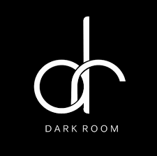

<!-- Improved compatibility of back to top link: See: https://github.com/othneildrew/Best-README-Template/pull/73 -->

<!--
*** Thanks for checking out the Best-README-Template. If you have a suggestion
*** that would make this better, please fork the repo and create a pull request
*** or simply open an issue with the tag "enhancement".
*** Don't forget to give the project a star!
*** Thanks again! Now go create something AMAZING! :D
-->

<!-- PROJECT SHIELDS -->
<!--
*** I'm using markdown "reference style" links for readability.
*** Reference links are enclosed in brackets [ ] instead of parentheses ( ).
*** See the bottom of this document for the declaration of the reference variables
*** for contributors-url, forks-url, etc. This is an optional, concise syntax you may use.
*** https://www.markdownguide.org/basic-syntax/#reference-style-links
-->

<!-- PROJECT LOGO -->
 

  
  

<h3 align="center">Dark Room</h3>

  

    A safe space for the visually impaired​
     
    <a href="https://github.com/sinking8/HackSC"><strong>Explore the docs »</strong></a>
     
     
  

<!-- TABLE OF CONTENTS -->

  
Table of Contents

  <ol>
    <li><a href="#about-the-project">About The Project</a> </li>
    <li><a href="#Project Inspiration">Project Inspiration</a></li>
    <li><a href="#What it does">What it does</a></li>
    <li><a href="#How you built it ">How you built it </a></li>
    <li><a href="#Built With ">Built With </a></li>
    <li><a href="#Challenges you ran into ">Challenges you ran into </a></li>
    <li><a href="#Accomplishments">Accomplishments</a></li>
    <li><a href="#What you learned">What you learned</a></li>
    <li><a href="#What's next for Project">What's next for Project</a></li>
  </ol>

<!-- ABOUT THE PROJECT -->
## About The Project

Dark Room is an AI-driven product in social media and video streaming arenas with a mission to enable community and entertainment reach to the visually impaired sections of the population. Dark Room provides audio descriptions for posts on platforms such as LinkedIn, X, and Instagram. An additional application is when plugged into the video streaming partners Dark Room can provide audio descriptive narrations for the entire content within a fraction of the time and costs. Alongside multiple revenue generation channels owing to the strong tide of digitization, Dark Room aims to eliminate the roadblocks the visually impaired face to keep up with the behavioral shifts of the rest of the world.

[![Dark Store Screen Shot][product-screenshot]](http://darkroom4.us/)

(<a href="#readme-top">back to top</a>)

<!-- Project Inspiration -->
## Project Inspiration
Equality is always established in all walks of human life. In the past two decades, social media has become an integral part of our lives. Today, an average young user spends about five hours of the day on social media. Social media drives decisions, emotions, and value. A medium that is so vastly used sees barely any inclusivity efforts for visually impaired users. It’s sometimes considered as unexplorable waters for these sections. In our efforts to eradicate such barriers ‘Dark Room’ is created. 

Social media platforms allow users to post pictures along with alternate text options to have equal reach throughout the audience including the visually impaired. However, this feature has negligible penetration due to a lack of awareness among the users. So a good low-cost solution such as ‘Dark Room’ is potentially a viable solution that does not rely on zero adoption and is one hundred percent compliant.    

A few movies in streaming media made in recent times include the video description with an intention to reach out to the visually impaired audience. However, the production houses are not fully working towards including such narrations for the older content. So with this product, the limitations of this issue can be mitigated and content can be made better accessible to the groups in discussion. Additionally, video and streaming platforms such as YouTube, Netflix, Hulu, and HBO Max can just plug in the application and make available audio descriptions to almost all content in a negligible time and minuscule investment.

<!-- What it does -->
## What it does
Our platform helps the visually impaired access social media to stay connected, build relations, access information on world events, and find employment opportunities. Over time there has been a shift beyond comprehension in the interplay of human relations. This product promoted the visually impaired to keep pace with the changes and enjoy the same and equal opportunities to grow and bond.

<!-- How you built it  -->
## How you built it 
- **Front end**: We first developed our front end on the React application that communicates with Python Flask API to successfully provide audio translation for each picture frame in the video. 

- **Back end**: In the next phase we used Redis to create our user and video data tables in the database. We relied on Streamlet to ensure communication between the Redis Database and the front-end application.

- **Machine Learning**: For image captioning Blip architecture was used to fetch descriptions for photos and video frames. The model was fine-tuned through active learning by training through many real-time data feeds.
(<a href="#readme-top">back to top</a>)

<!-- Challenges you ran into  -->
## Challenges you ran into
The first challenge that we faced while building our product was connecting the front end and back end. And another roadblock we had to deal with was interacting with the Redis DB. The other problem that we spent time on was reducing the processing time for the descriptions on the video.

<!-- Accomplishments  -->
## Accomplishments

We are proud that through our product we can bridge the large unattended accessibility gap among people. We believe our product will create a large-scale impact in the lives of visually impaired people. Through this app, a visually impaired person who wishes to seek employment or start a small shop can have an easier way like all of us do. 

<!-- What you learned  -->
## What you learned

Additionally, we learned to use new tools like Redis, and Streamlit to build our product. These new products have been very convenient and we will continue using them in our future projects.

<!-- What's next for Project  -->
## What's next for Project

Going forward we want to integrate selective descriptions to ensure concise and confined narrations that align with the video’s original audio to improve viewer experience.

<!-- MARKDOWN LINKS & IMAGES -->
<!-- https://www.markdownguide.org/basic-syntax/#reference-style-links -->
[contributors-shield]: https://img.shields.io/github/contributors/github_username/repo_name.svg?style=for-the-badge
[contributors-url]: https://github.com/github_username/repo_name/graphs/contributors
[forks-shield]: https://img.shields.io/github/forks/github_username/repo_name.svg?style=for-the-badge
[forks-url]: https://github.com/github_username/repo_name/network/members
[stars-shield]: https://img.shields.io/github/stars/github_username/repo_name.svg?style=for-the-badge
[stars-url]: https://github.com/github_username/repo_name/stargazers
[issues-shield]: https://img.shields.io/github/issues/github_username/repo_name.svg?style=for-the-badge
[issues-url]: https://github.com/github_username/repo_name/issues
[license-shield]: https://img.shields.io/github/license/github_username/repo_name.svg?style=for-the-badge
[license-url]: https://github.com/github_username/repo_name/blob/master/LICENSE.txt
[linkedin-shield]: https://img.shields.io/badge/-LinkedIn-black.svg?style=for-the-badge&logo=linkedin&colorB=555
[linkedin-url]: https://linkedin.com/in/linkedin_username
[product-screenshot]: screenshot.png
[Next.js]: https://img.shields.io/badge/next.js-000000?style=for-the-badge&logo=nextdotjs&logoColor=white
[Next-url]: https://nextjs.org/
[React.js]: https://img.shields.io/badge/React-20232A?style=for-the-badge&logo=react&logoColor=61DAFB
[React-url]: https://reactjs.org/
[Vue.js]: https://img.shields.io/badge/React-20232A?style=for-the-badge&logo=react&logoColor=61DAFB
[Vue-url]: https://vuejs.org/](https://pythonbasics.org/what-is-flask-python/
[Angular.io]: https://img.shields.io/badge/Angular-DD0031?style=for-the-badge&logo=angular&logoColor=white
[Angular-url]: https://angular.io/
[Svelte.dev]: https://img.shields.io/badge/Svelte-4A4A55?style=for-the-badge&logo=svelte&logoColor=FF3E00
[Svelte-url]: https://svelte.dev/
[Laravel.com]: https://img.shields.io/badge/Laravel-FF2D20?style=for-the-badge&logo=laravel&logoColor=white
[Laravel-url]: https://laravel.com
[Bootstrap.com]: https://img.shields.io/badge/Bootstrap-563D7C?style=for-the-badge&logo=bootstrap&logoColor=white
[Bootstrap-url]: https://getbootstrap.com
[JQuery.com]: https://img.shields.io/badge/jQuery-0769AD?style=for-the-badge&logo=jquery&logoColor=white
[JQuery-url]: https://jquery.com 
